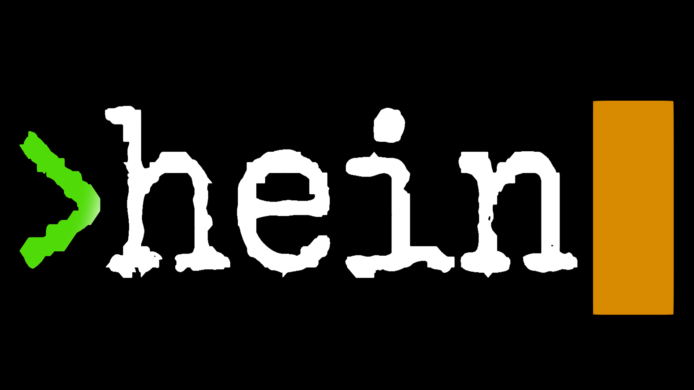
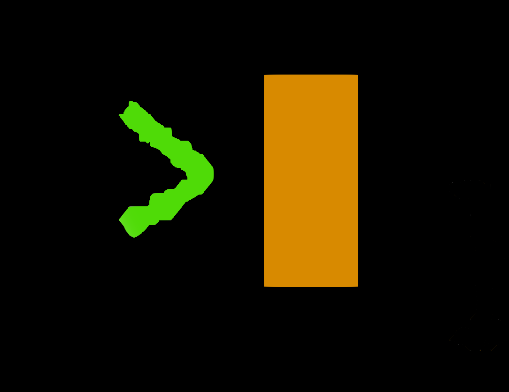
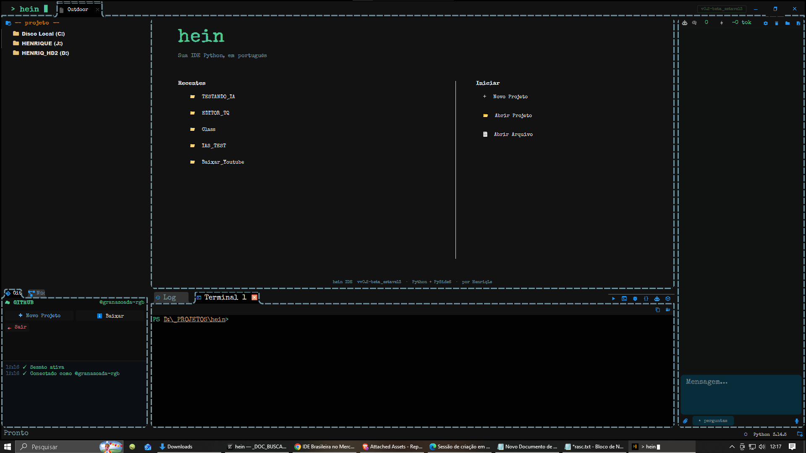
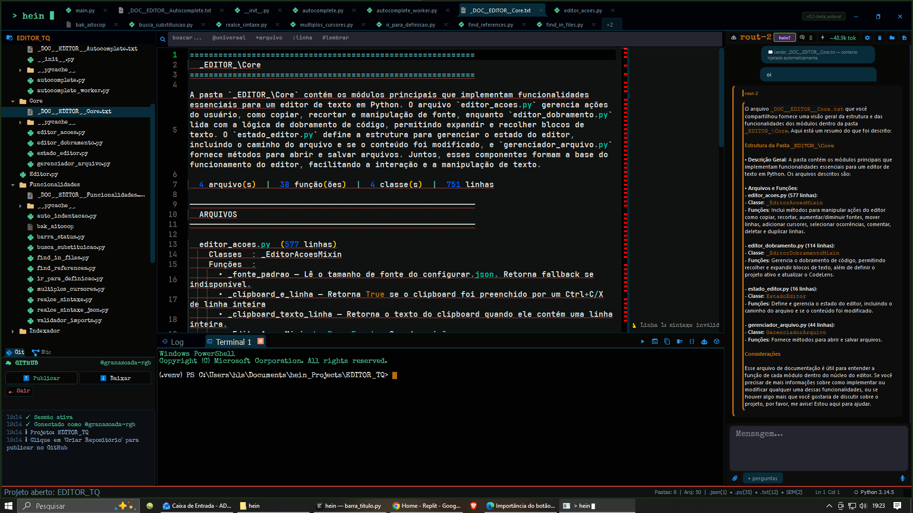
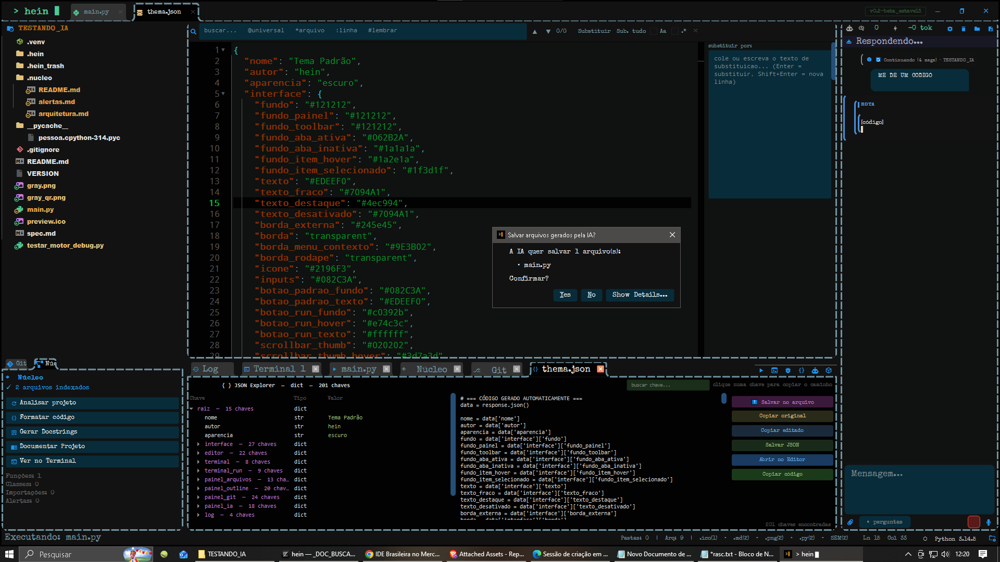
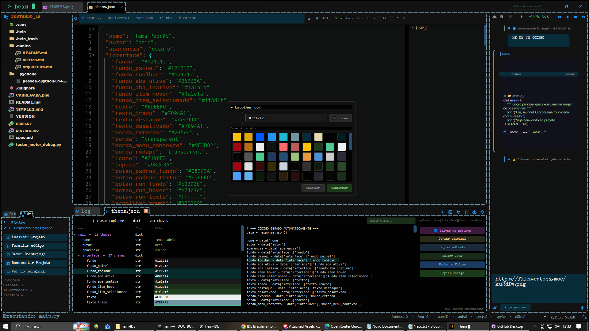

  

  

<h1 align="center">hein IDE</h1>

<b>IDE Brasileira para Python, GitHub e Inteligência Artificial</b>

A IDE que entende o seu projeto.

Desenvolvida no Brasil, em português, para programadores brasileiros.

  
  
  
  
  

<a href="https://github.com/Henriq-Ls/hein-IDE/releases">Download</a> •
<a href="https://github.com/Henriq-Ls/hein-IDE/issues">Issues</a> •
<a href="https://www.youtube.com/@henriqls">YouTube</a>

---

# O que é a hein IDE?

A hein IDE é uma IDE desktop desenvolvida do zero em Python e PySide6.

Ela foi criada para ir além da edição de código tradicional.

Enquanto a maioria das IDEs trabalha apenas com arquivos e abas abertas, a hein IDE combina indexação AST, memória persistente, inteligência artificial contextual, documentação automática, integração GitHub e uma base de conhecimento capaz de acompanhar a evolução do projeto ao longo do tempo.

O objetivo é simples:

Criar uma IDE que entenda o projeto inteiro, e não apenas os arquivos que estão abertos na tela.

---

# Por que a hein IDE existe?

A maior parte das IDEs modernas foi criada pensando primeiro no mercado internacional.

A hein IDE nasceu com uma proposta diferente.

Ser uma IDE moderna, poderosa e acessível para desenvolvedores brasileiros.

Não apenas traduzida para português.

Pensada em português.

Desde a interface até a integração com IA, documentação automática, GitHub e fluxo de desenvolvimento.

A ideia é aproximar a ferramenta da forma como programadores brasileiros realmente trabalham.

---

# Principais Diferenciais

## IA Contextual Integrada

A IA da hein IDE entende o projeto aberto.

Recursos:

- Leitura automática do projeto
- Indexação AST
- Memória persistente por projeto
- Injeção automática do arquivo aberto
- Leitura automática de arquivos mencionados
- Streaming em tempo real
- Fallback automático entre modelos
- OpenAI
- OpenRouter
- Ollama
- Modelos locais
- Exportação de histórico
- Entrada de voz integrada
- Análise crítica automática via hein?
- Detecção de perda de contexto
- Geração automática de correções

---

## HEIN-PATCH

A IA pode sugerir alterações diretamente no código aberto.

Antes de qualquer modificação:

- Diff visual completo
- Confirmação do usuário
- Backup automático
- Compatível com Ctrl+Z
- Nenhuma gravação automática em disco

A decisão final continua sempre com o desenvolvedor.

---

## Núcleo de Conhecimento

A hein IDE possui uma camada própria chamada Núcleo.

O Núcleo acompanha a evolução do projeto e mantém uma base de conhecimento persistente.

Ele registra:

- Arquitetura
- Histórico técnico
- Dependências
- Estrutura do projeto
- Decisões importantes
- Alertas estruturais
- Estado atual do software

Esse conhecimento pode ser reutilizado pela IA para fornecer respostas cada vez mais contextualizadas.

---

## Documentação Automática

A IDE pode gerar automaticamente:

- README.md
- DOCUMENTACAO.md
- ARQUITETURA.md
- Estrutura_projeto.txt

Mantendo documentação e código alinhados.

---

## Busca Unificada

| Prefixo | Função |
|----------|----------|
| texto | Buscar arquivos |
| @texto | Buscar conteúdo |
| :123 | Ir para linha |
| >comando | Command Palette |
| #todo | Anotações |
| #fixme | Anotações |
| #lembrar | Anotações |

Tudo centralizado em uma única barra de busca.

---

# Ambiente de Desenvolvimento

Recursos disponíveis:

- Editor avançado para Python
- Múltiplas abas
- Outline estrutural
- Navegação por definição
- Referências indexadas
- Autocomplete inteligente
- Auto Save
- Terminal integrado
- Execução isolada em .venv
- Monitoramento de arquivos
- Painel Git integrado
- Integração GitHub
- Sistema de temas
- IA contextual

---

# Git e GitHub

A integração Git foi desenvolvida diretamente dentro da IDE.

Recursos:

- Clone
- Commit
- Push
- Pull
- Branches
- Stash
- Histórico
- Diff visual
- Login GitHub integrado
- Publicação de projetos

Sem depender constantemente do terminal.

---

# Sistema de Temas

Sistema completo de temas com atualização dinâmica.

- Hot Reload
- Cores centralizadas
- Ícones integrados ao tema
- Atualização instantânea sem reiniciar

---

# Arquitetura

Tecnologias utilizadas:

- Python
- PySide6
- SQLite
- AST nativo do Python
- Git
- GitHub API
- OpenAI API
- OpenRouter
- Ollama
- LangGraph
- FAISS

---

# Roadmap

Próximos objetivos da plataforma:

- Integração completa do sistema de memória LangGraph
- Busca semântica por vetores
- Melhorias no sistema de documentação automática
- Evolução do Núcleo de Conhecimento
- Mais recursos de IA contextual
- Novos temas visuais
- Expansão da integração GitHub
- Suporte futuro para múltiplas linguagens

---

# Download

## Última versão

https://github.com/Henriq-Ls/hein-IDE/releases

Baixe o executável mais recente.

Não é necessário instalar Python ou dependências adicionais.

---

# Requisitos

- Windows 10 ou superior
- Sistema 64 bits
- Internet para recursos online
- Nenhuma instalação adicional necessária

---

# Comunidade

Sugestões, ideias, bugs e melhorias são sempre bem-vindos.

Issues:

https://github.com/Henriq-Ls/hein-IDE/issues

---

# Contato

GitHub

https://github.com/Henriq-Ls

YouTube

https://www.youtube.com/@henriqls

WhatsApp

+55 62 98134-4007

---

# Autor

HenriqLs

---

<b>hein IDE</b> 
Uma IDE brasileira criada para programadores brasileiros.

